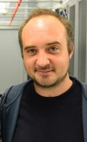
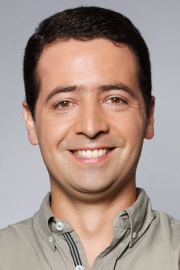

# Mark Dunning

Mark Dunning obtained his PhD in the Statistics and Computational Biology group of Simon Tavare at the University of Cambridge. During this time, he developed Bioconductor packages for the analysis of Illumina microarray data. He then joined the Bioinformatics Core at Cancer Research Uk Cambridge Institute and has several years of experience working in analysing data from various high-throughput technologies and developing computational pipelines. In his current role, Mark organises and develops Bioinformatics training courses.

**Affiliation:** Cancer Research Uk Cambridge Institute, University of Cambridge, Cambridge, UK

# Tom Carroll

After completing his masters in Bioinformatics, Tom Carroll studied for his PhD at Kings College London investigating the transcriptomic effects of environmental toxicants. Following this, Tom joined Cancer Research Uk Cambridge Institute as a Senior Bioinformatics Analyst working on a variety of high throughput sequencing projects before joining the MRC Clinical Sciences Centre as the Head Of Bioinformatics in 2014. While working as the Head of Bioinformatics, Tom directs training activities, data capture and processing from research cores and manages the Core Bioinformatics Team. Tom has gained substantial experience in ChIP-seq analysis working both at the MRC and CRUK and has created and maintains several ChIP-seq related Bioconductor packages (ChIPQC, tracktables, soGGi).

**Affilation:** Medical Research Council, Clinical Sciences Centre (Imperial College London)

# Nuno Barbosa-Morais 

Nuno Barbosa-Morais graduated in Technologic Physics Engineering from
Instituto Superior Técnico (Lisbon, Portugal) and did his PhD in Biomedical
Sciences at the University of Lisbon Medical School with Prof. Carmo
Fonseca, although most of the PhD research actually took place at the
University of Cambridge (UK) with Dr. Samuel Aparicio. He then became a
Research Associate in the Computational Biology Group (led by Prof. Simon
Tavaré) at the University of Cambridge, based at the CRUK Cambridge
Institute, where he developed a general pipeline for microarray probe
reannotation and his work in determining the molecular mechanisms
responsible for the stability of transcriptional programs has involved the
analysis, annotation and integration of different sorts of array and
sequence information. Nuno then moved to the University of Toronto (Canada)
to become a Senior Postdoctoral Fellow in Prof. Ben Blencowe's lab, where
his survey of the evolution of tissue-specific alternative splicing in
vertebrates involved analysing transcriptomic high-throughput sequencing
data. Nuno now leads the Computational Biology research group at Instituto
de Medicina Molecular in Lisbon, with his research focused on disease
transcriptomics.

**Affiliation:** Instituto de Medicina Molecular, Lisboa, PT

